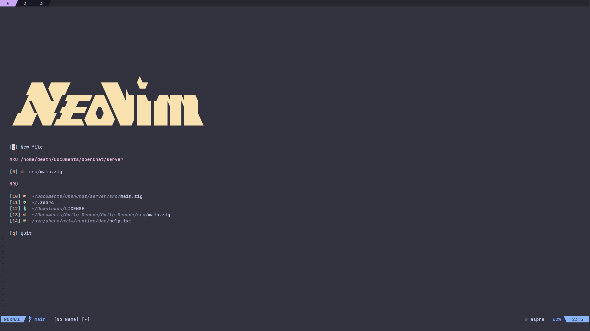
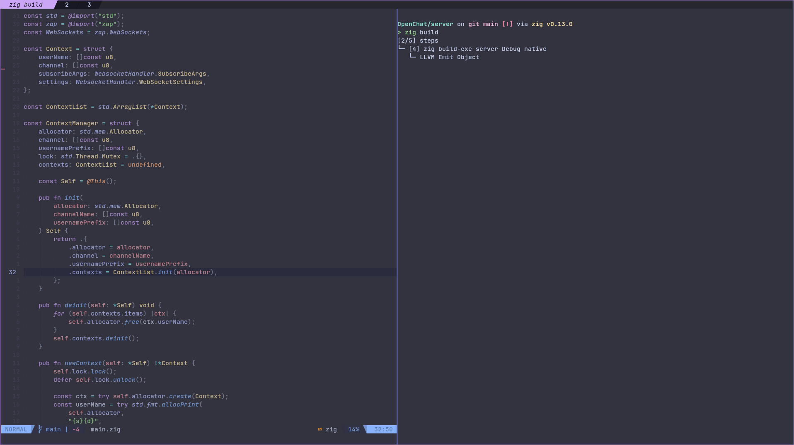
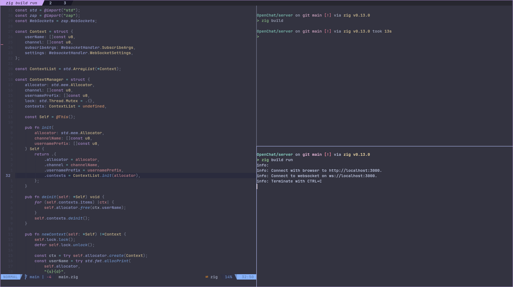

# My Terminal Config  

## Showcase  
Here’s a preview of the terminal setup in action:  

|  | |  
|-----------------------------------------|-----------------------------------------|  
|  |  |  

## Requirements  
Before setting up this terminal configuration, make sure the following tools are installed:  

- **Kitty** (Terminal emulator)  
- **Neovim (nvim)** (Text editor)  
- **Zsh** (Shell) 
- **Zoxide** (Shell Intigration)
- **Fzf** (Shell Intigration)
- **Starship Prompt** (Cross-shell prompt)  

## Info