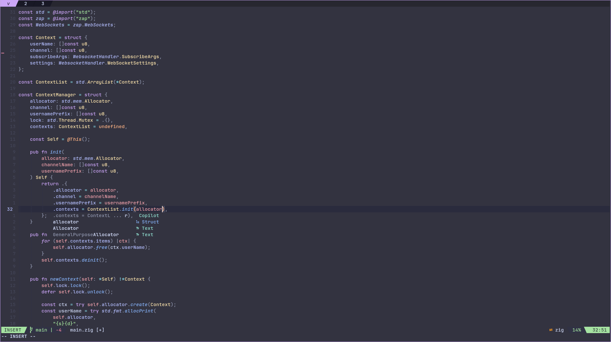

# My Terminal Config  

## Showcase  
Here’s a preview of the terminal setup in action:  

<tr>
  <td></td>
  <td></td>
</tr>
<tr>
  <td></td>
  <td></td>
</tr>

## Requirements  
Before setting up this terminal configuration, make sure the following tools are installed:  

- **Kitty** (Terminal emulator)  
- **Neovim (nvim)** (Text editor)  
- **Zsh** (Shell)  
- **Starship Prompt** (Cross-shell prompt)  
